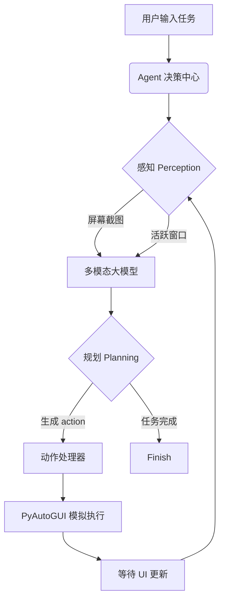

# WordWill: Open-AutoGLM PC Migration 🖥️🤖

[](https://www.python.org/)
[](LICENSE)
[](https://apple.com)

**WordWill** 是 [Open-AutoGLM](https://github.com/zai-org/Open-AutoGLM.git) 的 PC 端迁移版本，专为桌面端环境进行深度适配。它利用多模态大模型（如 AutoGLM-Phone-9B 转化版或同类能力模型）实现对桌面操作系统的自主控制，将原本在手机端的“点击、滑动、输入”等原子操作无缝平移至键盘鼠标环境。

---

## 🌟 核心特性

- 🖥️ **桌面端深度优化**：针对 PC 分辨率和操作习惯，将 0-1000 的相对坐标精准映射至物理屏幕像素。
- 🖱️ **原生键鼠仿真**：支持点击、双击、长按、拖拽、文本输入等原生桌面交互。
- 📱 **AutoGLM 指令兼容**：完美兼容 `do()` 与 `finish()` 指令体系，支持多步规划与闭环执行。
- 🍎 **macOS 深度集成**：内置 `osascript` 进程检测，精准获取当前活动窗口，支持通过 Bundle ID 直接启动应用。
- 🔄 **视觉感知循环**：Perception (截图) -> Planning (模型思考) -> Execution (自动化执行) 的完整智能环路。

## 🚀 快速开始

### 1. 环境准备

项目要求 Python 3.13+ 环境。推荐使用 `uv` 进行依赖管理：

```bash
# 安装依赖
uv pip install -r pyproject.toml
```

### 2. 配置环境变量

在根目录创建 `.env` 文件并配置你的模型参数：

```env
PC_AGENT_BASE_URL="http://your-model-endpoint/v1"
PC_AGENT_API_KEY="your-api-key"
PC_AGENT_MODEL="autoglm-phone-9b"
```

### 3. 运行任务

直接在命令行输入你想要执行的任务：

```bash
# 自动打开浏览器并搜索
python main.py "帮我打开 Chrome 并搜索 DeepSeek"

# 办公自动化示例
python main.py "打开微信给张三发一条消息说：今天下午两点开会"
```

## 🛠️ 支持的动作 (Actions)

| 动作 | 说明 | 示例 |
| :--- | :--- | :--- |
| `Launch` | 启动特定应用程序 | `do(action="Launch", app="WeChat")` |
| `Tap` | 模拟鼠标左键单击 | `do(action="Tap", element=[500, 500])` |
| `Double Tap`| 模拟鼠标双击 | `do(action="Double Tap", element=[100, 200])` |
| `Type` | 模拟键盘文本输入 | `do(action="Type", text="Hello AI")` |
| `Swipe` | 模拟拖拽/滚动 | `do(action="Swipe", start=[500, 800], end=[500, 200])` |
| `Home` | 回到桌面 (macOS F3) | `do(action="Home")` |
| `Back` | 返回 (macOS Cmd+[) | `do(action="Back")` |
| `Wait` | 等待 UI 响应 | `do(action="Wait", duration="2 seconds")` |

## 📐 架构设计



## ⚠️ 注意事项

- **模型依赖**：**Agent 的任务完成能力高度取决于底层多模态大模型的能力**。建议使用对界面理解（UI Perception）和指令遵循（Instruction Following）优化过的模型。
- **安全性**：本工具涉及对电脑的直接控制，执行涉及金融、隐私等敏感操作时请务必谨慎并开启 `confirm_sensitive` 模式。
- **系统权限**：在 macOS 上运行需要授予终端/IDE "辅助功能 (Accessibility)" 和 "屏幕录制 (Screen Recording)" 权限。
- **分辨率**：建议在单一显示器环境下使用，多显示器适配目前处于实验阶段。

---

## 🙌 致谢

本项目深受以下开源项目的启发和支持：

- [Open-AutoGLM](https://github.com/zai-org/Open-AutoGLM.git)：由 zai-org 开发的自主智能体框架，本项目核心指令逻辑与之兼容。

---

> 基于 WordWill，让 AI 真正接管你的桌面。
